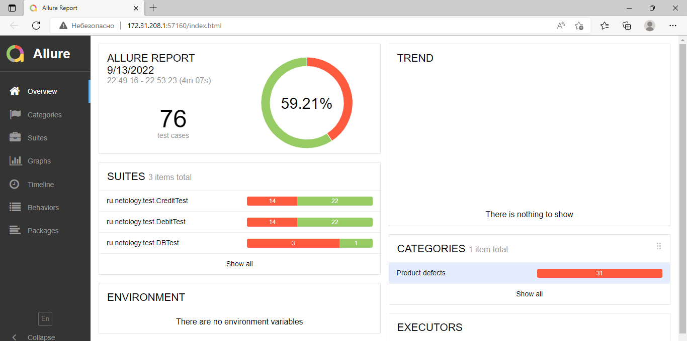
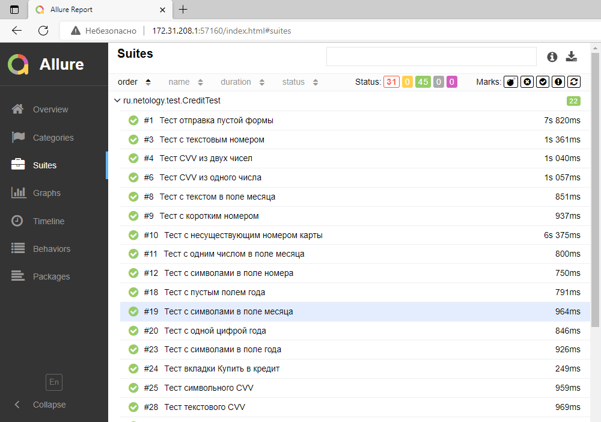
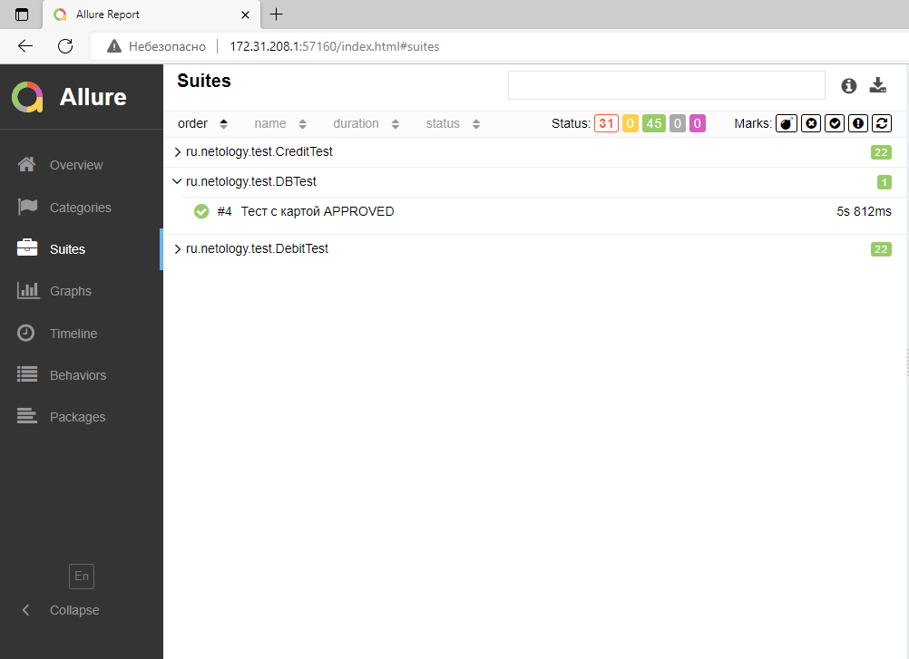
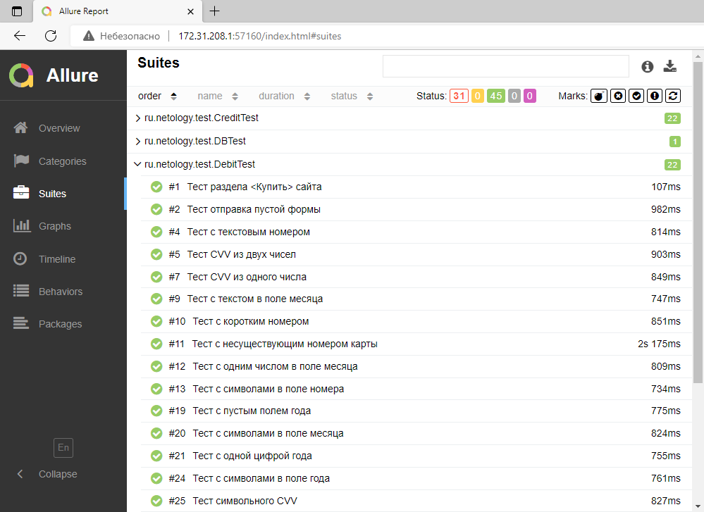
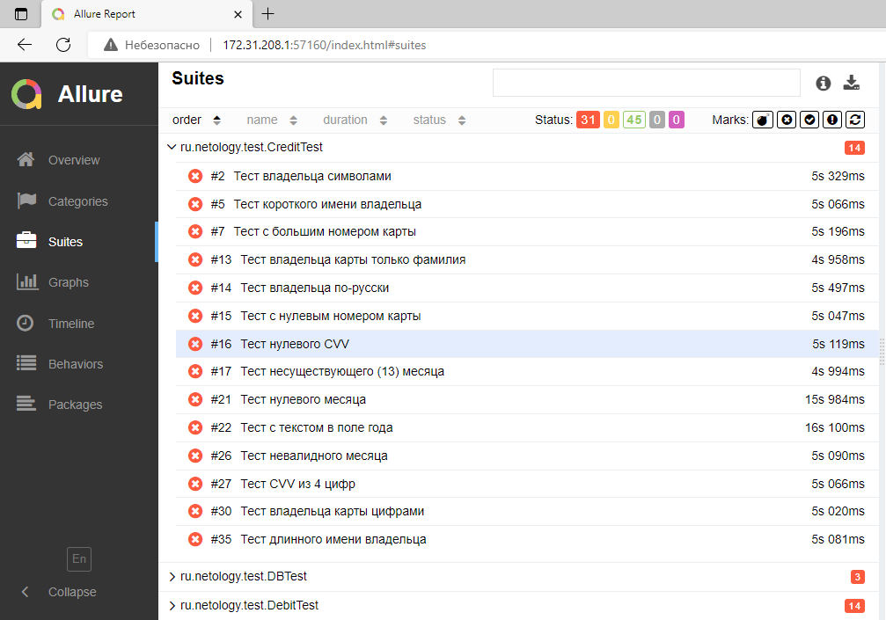
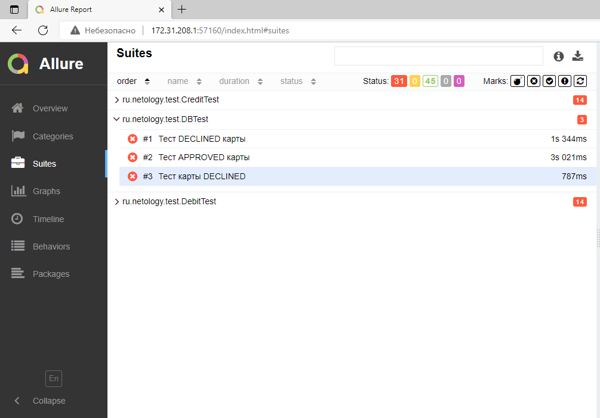
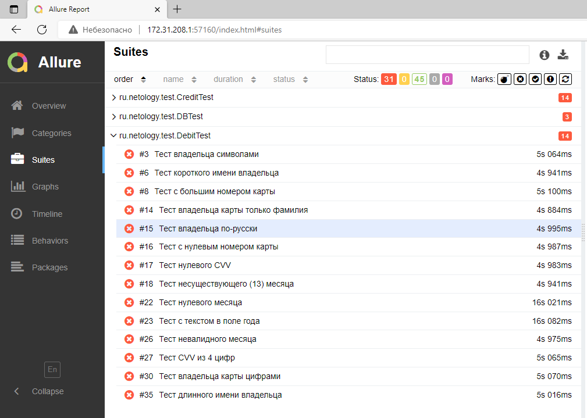

# Отчёт о проведённом тестировании

## Краткое описание
> * Автоматизировано тестирование комплексного сервиса покупки тура, взаимодействующего с СУБД и API Банка.

## Общее количество тест кейсов: 
> * Общее количество тест-кейсов для обеих СУБД - 76 шт

## Статистика успешных/неуспешных кейсов

> * Успешных кейсов 59,21% (45 из 76)
> * Неуспешных кейсов 40,79% (31 из 76)

   
Report

  

  

## Общие рекомендации
1. Исправить орфографическую ошибку в слове Марракеш
2. Исправить ошибку в названии приложения покупки тура 
3. Исправить дефекты связанные с неверными сообщениями об ошибках.
4. Для поля "Владелец" ввести ограничение на вводимые символы - только английские буквы.
5. Сделать кнопку "Продолжить" неактивной, если есть пустые и/или неправильно заполненные поля.

**Полный список найденных дефектов находится в [Issues](https://github.com/Votgosh/Diploma/issues)**